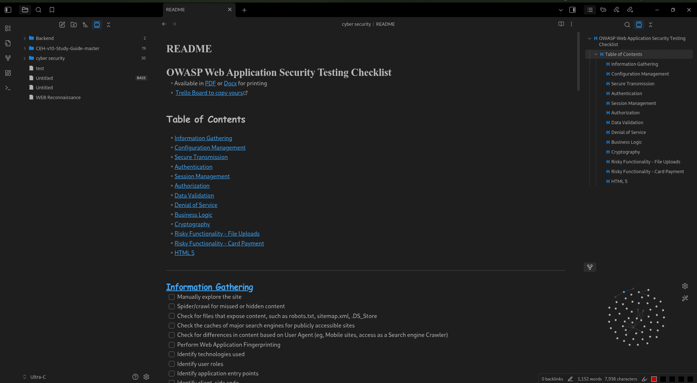

## obsidian CSS snippet

Little modification on native obsidian theme

###### modifications
- balck tab bar without outlines
- all app tabs with same color (1e1e1e) 
- folder and file icons
- outline symbol
- darker text color
- h1 font (Times roman)
- h2-6 font (comic sans ms)
#### to use 
add style.css file in " .obsidian/snippets" in your valut folder 
